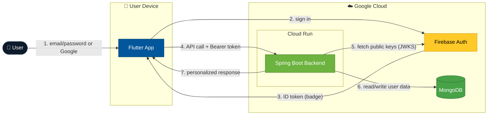
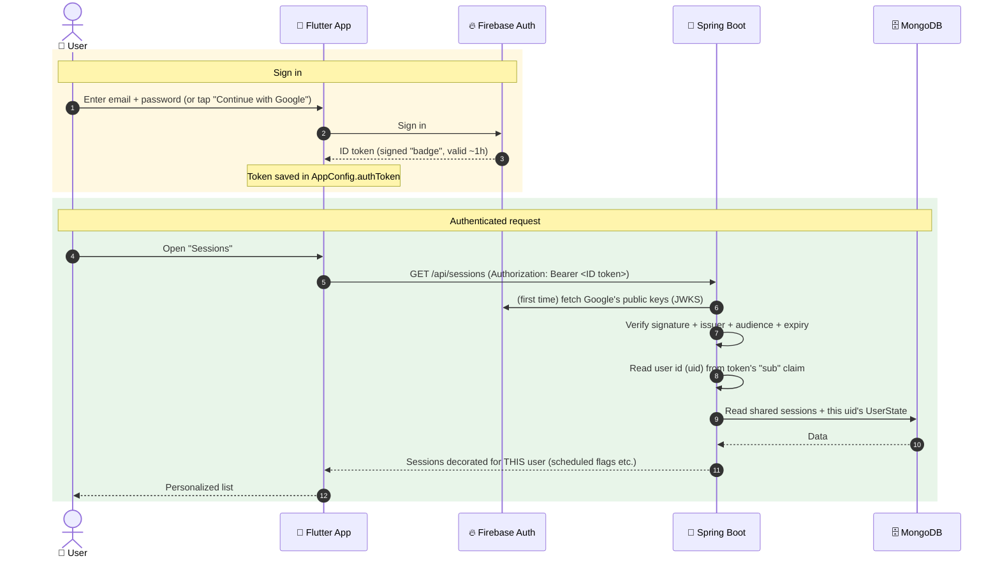
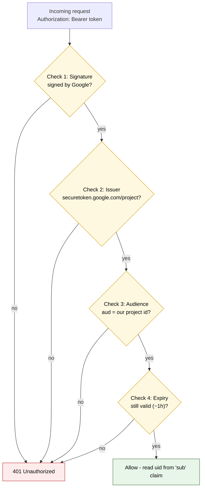

<div align="center">

# 🔐 Authentication — Complete Guide
### Cisco Live Concierge


</div>

> [!NOTE]
> **Purpose of this document** — explain **how login and security work end‑to‑end**, in
> plain language, so anyone (even a non‑developer) can understand it, and so a developer
> has every command and file reference needed to run or change it.

---

## 📑 Table of contents

1. [The one‑paragraph summary](#1-the-oneparagraph-summary-for-anyone)
2. [The moving parts](#2-the-moving-parts-who-does-what)
3. [The big picture](#3-the-big-picture-diagram)
4. [How the backend checks the badge](#4-how-the-backend-checks-the-badge-id-token-validation)
5. [What the Flutter app does](#5-what-the-flutter-app-does)
6. [Configuration reference](#6-configuration-reference-the-exact-knobs)
7. [How it was set up (commands)](#7-stepbystep-how-it-was-set-up-the-commands)
8. [How to test it works](#8-how-to-test-it-works)
9. [Common questions & gotchas](#9-common-questions--gotchas)
10. [File map](#10-file-map-quick-reference)

---

## 1. The one‑paragraph summary (for anyone)

Before this change, **anybody** who knew the backend web address could read and write
data — there was no login. Now the app has a **login screen**. A user signs in with
their **email + password** (or **Google**). A trusted Google service called **Firebase
Authentication** checks their identity and hands the app a **digital ID card** (called an
*ID token*). Every time the app talks to our backend, it shows this ID card. Our backend
**inspects the ID card**, confirms it is genuine and issued for *our* project, and only
then answers. Each user’s data is kept separate, so two people signing in see **their own**
schedule, notes, saved contacts and goals.

> [!TIP]
> **Think of it like a conference badge** 🎟️
> - **Firebase** = the registration desk that verifies who you are and prints your badge.
> - **ID token** = the printed badge (valid for ~1 hour, then reprinted automatically).
> - **Our backend** = the security guard at every door who checks the badge is real and
>   belongs to this event before letting you in.

---

## 2. The moving parts (who does what)

| Part | Where it lives | Job |
|------|----------------|-----|
| **Firebase Authentication** | Google cloud (project `eloquent-hour-445710-s0`) | Verifies email/password & Google logins, issues ID tokens |
| **Flutter app** | `flutter_app_cisco/` | Shows login screen, stores the ID token, attaches it to every API call |
| **Spring Boot backend** | `feb-ciscolive-concierge/` | Validates the ID token on every request, then returns that user’s data |
| **MongoDB** | Cloud (via `MONGODB_URI`) | Stores the data; each record is tied to a user id where relevant |
| **Cloud Run** | Google cloud | Hosts the backend; holds the config (project id, Mongo URI) as env vars |

---

## 3. The big picture (diagram)

### 3a. System landscape (who talks to whom)



### 3b. Login + request flow (step by step)



---

## 4. How the backend checks the "badge" (ID token validation)

Every call to `/api/**` (except a few public health endpoints) must carry an
`Authorization: Bearer <token>` header. The backend performs **four checks**:



1. **Signature** — Is the token really signed by Google? The backend downloads Google’s
   public keys (the **JWKS**) and verifies the cryptographic signature.
2. **Issuer** — Was it issued by `https://securetoken.google.com/<our-project-id>`?
3. **Audience** — Was it minted **for our project** (`aud` = our project id)? This blocks
   tokens from some *other* Firebase project.
4. **Expiry** — Is it still within its ~1‑hour validity window?

If all pass, the request proceeds. If any fail, the backend returns **401 Unauthorized**.

### The code that does this

- `config/SecurityConfig.java` — wires everything up:
  - `.oauth2ResourceServer(oauth2 -> oauth2.jwt(...))` turns the app into a
    **resource server** that expects a JWT bearer token.
  - `jwtDecoder()` builds a validator = **default issuer/expiry check** +
    **`AudienceValidator`**, using Google’s JWKS URL
    `https://www.googleapis.com/service_accounts/v1/jwk/securetoken@system.gserviceaccount.com`.
  - Public (no login) endpoints: `/api/health`, `/api/heartbeat`, `/api/ping`, and Swagger.
    Everything else = `authenticated()`.
  - **Stateless** (no server sessions) and **CSRF disabled** — correct for a token API.
  - **CORS** origins come from `app.cors.allowed-origins`.
- `config/AudienceValidator.java` — the custom check that the token’s `aud` equals our
  project id.
- `config/CurrentUser.java` — a tiny helper the services call to get the logged‑in user’s
  id. It reads the **`sub`** claim (the Firebase **UID**) from the validated token. If no
  valid user is present, it throws **401**.

> [!IMPORTANT]
> **Key idea:** the UID (`sub` claim) is the single value that ties a request to a person.
> The backend never trusts a user id sent in the request body — it only trusts the one
> inside the cryptographically verified token.

---

## 5. What the Flutter app does

| File | Responsibility |
|------|----------------|
| `lib/firebase_options.dart` | Generated config so the app can reach the right Firebase project (android/web/ios) |
| `lib/main.dart` | Initializes Firebase, then shows the **AuthGate**: login screen when signed out, the app when signed in |
| `lib/services/auth_service.dart` | Sign in / register / Google / password‑reset / **sign out**; keeps `AppConfig.authToken` fresh |
| `lib/screens/login_screen.dart` | The login UI (email/password, Google, splash background) |
| `lib/config.dart` | Holds `authToken` and an `onUnauthorized` hook used to refresh the token on a 401 |
| `lib/services/api_service.dart` | Attaches `Authorization: Bearer <token>` to every request; on 401 refreshes the token and retries once |

### Token lifecycle (automatic)
- On login, Firebase gives an ID token; `AuthService` stores it in `AppConfig.authToken`.
- `AuthService` listens to `idTokenChanges()` — Firebase **auto‑refreshes** the token
  roughly every hour, and the new token is saved automatically.
- If the backend ever returns **401**, the API layer calls `onUnauthorized` →
  `AuthService._refreshToken()` forces a brand‑new token and retries the request once.
- **Sign out** calls `GoogleSignIn().signOut()` (wrapped in try/catch so it can’t block)
  and then `FirebaseAuth.signOut()`. The AuthGate immediately returns to the login screen.

---

## 6. Configuration reference (the exact knobs)

### Backend — `src/main/resources/application.properties`
```properties
spring.data.mongodb.uri=${MONGODB_URI:}
spring.data.mongodb.database=ciscolive_concierge
server.port=${PORT:8080}
app.use-dummy=false                                   # false = use MongoDB (production)
firebase.project-id=${FIREBASE_PROJECT_ID:}           # e.g. eloquent-hour-445710-s0
app.cors.allowed-origins=${CORS_ALLOWED_ORIGINS:http://localhost:*,https://*.run.app}
```

### Backend — `pom.xml` (the dependency that enables token validation)
```xml
<dependency>
  <groupId>org.springframework.boot</groupId>
  <artifactId>spring-boot-starter-oauth2-resource-server</artifactId>
</dependency>
```

### Firebase project facts
- Project id: `eloquent-hour-445710-s0`  (project number `755498942514`)
- Android app id: `1:755498942514:android:afaa0db76329c52060fc2b`
- Web app id: `1:755498942514:web:a0f161c2c866161560fc2b`
- Issuer the backend trusts: `https://securetoken.google.com/eloquent-hour-445710-s0`
- Audience the backend requires: `eloquent-hour-445710-s0`

---

## 7. Step‑by‑step: how it was set up (the commands)

### A. One‑time tooling (already done)
```powershell
npm install -g firebase-tools
dart pub global activate flutterfire_cli
# flutterfire lives at: C:\Users\akshkum4\AppData\Local\Pub\Cache\bin\flutterfire.bat
firebase login
```

### B. Connect the Flutter app to Firebase (generates config files)
```powershell
cd 'C:\Code\flutter_app_cisco'
flutterfire configure --project=eloquent-hour-445710-s0 --platforms=android,web,ios --yes
# -> creates/updates lib/firebase_options.dart and android/app/google-services.json
```

### C. Turn on sign‑in methods (Firebase Console, one time)
1. Firebase Console → **Authentication** → **Sign‑in method**.
2. Enable **Email/Password**.
3. Enable **Google**.
4. (For real web domains) Authentication → **Settings → Authorized domains** → add the
   domain. `localhost` is authorized by default for local testing.

### D. Tell the backend which project to trust, then deploy
On **Cloud Run** set the environment variable and redeploy:
```
FIREBASE_PROJECT_ID = eloquent-hour-445710-s0
```

> [!WARNING]
> If `FIREBASE_PROJECT_ID` is missing or wrong on Cloud Run, **every** authenticated
> request fails with 401 (the audience/issuer check can’t match). Also ensure `MONGODB_URI`
> is set and `app.use-dummy` stays `false` in production.

### E. Build / run locally
```powershell
# Backend
cd 'C:\Code\feb-ciscolive-concierge\feb-ciscolive-concierge'
.\mvnw.cmd clean compile        # or: .\mvnw.cmd spring-boot:run

# Flutter app
cd 'C:\Code\flutter_app_cisco'
flutter run                     # press R to hot restart after auth changes
```

---

## 8. How to test it works

**Without a token → should be blocked (401):**
```powershell
curl.exe -i https://feb-ciscolive-concierge-755498942514.us-west1.run.app/api/sessions
# Expect: HTTP/1.1 401 Unauthorized
```

**Health endpoint is public → should work (200):**
```powershell
curl.exe -i https://feb-ciscolive-concierge-755498942514.us-west1.run.app/api/health
# Expect: HTTP/1.1 200
```

**With a token (from a logged‑in app) → should work (200):**
```powershell
curl.exe -i -H "Authorization: Bearer <PASTE_ID_TOKEN>" `
  https://feb-ciscolive-concierge-755498942514.us-west1.run.app/api/sessions
```

**End‑to‑end (two accounts):** log in as user A, schedule a session / save a contact /
add a note; log out; log in as user B → B sees an **empty/independent** set. The shared
session catalog itself looks identical to both.

> [!TIP]
> To grab a real ID token for the `curl` test: sign in on the app, then read
> `AppConfig.authToken` (or print `await FirebaseAuth.instance.currentUser!.getIdToken()`),
> and paste it after `Bearer `.

---

## 9. Common questions & gotchas

<details>
<summary><b>Where does the user id come from?</b></summary>

The `sub` claim inside the verified token. Read via `CurrentUser.uid()`. Never taken from
the request body.
</details>

<details>
<summary><b>Do I need to change the frontend when backend data logic changes?</b></summary>

No. The API contract (URLs, request/response shapes) is unchanged; the backend simply
scopes data by the token’s user id.
</details>

<details>
<summary><b>What happens when a token expires?</b></summary>

Handled automatically — Firebase refreshes it; a 401 triggers one forced refresh + retry.
</details>

<details>
<summary><b>Google sign‑in on web fails?</b></summary>

Make sure the site’s domain is in Firebase **Authorized domains**. `localhost` already works.
</details>

<details>
<summary><b>Is the health check still open?</b></summary>

Yes, on purpose, so Cloud Run/monitoring can ping it without a token: `/api/health`,
`/api/heartbeat`, `/api/ping`.
</details>

<details>
<summary><b>Is it stateless?</b></summary>

Yes — no server‑side sessions or cookies. Every request stands on its own bearer token,
which scales cleanly on Cloud Run.
</details>

---

## 10. File map (quick reference)

**Backend (`feb-ciscolive-concierge/src/main/java/.../`)**
- `config/SecurityConfig.java` — filter chain, JWT decoder, CORS
- `config/AudienceValidator.java` — audience (`aud`) check
- `config/CurrentUser.java` — reads UID (`sub`) from the token
- `resources/application.properties` — project id, CORS, Mongo, dummy flag
- `pom.xml` — `spring-boot-starter-oauth2-resource-server`

**Flutter (`flutter_app_cisco/lib/`)**
- `main.dart` — Firebase init + AuthGate
- `services/auth_service.dart` — sign in/up/out, token refresh
- `screens/login_screen.dart` — login UI
- `config.dart` — `authToken`, `onUnauthorized`
- `services/api_service.dart` — Bearer header + 401 retry
- `firebase_options.dart` — generated Firebase config
