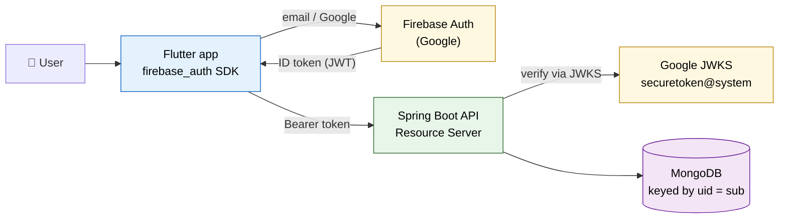
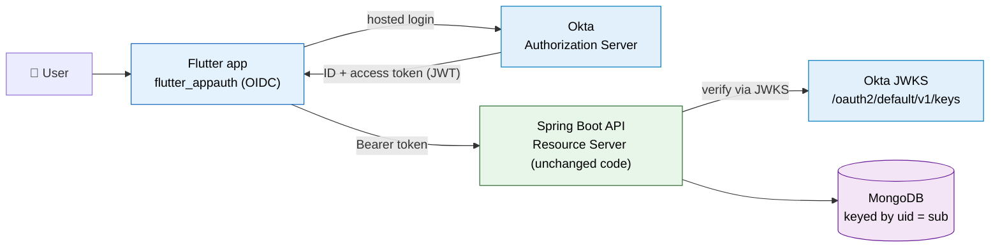
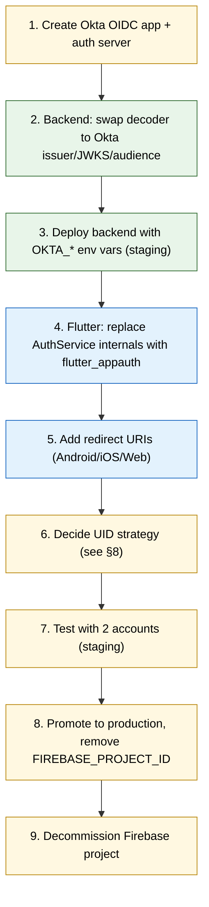

<div align="center">

# 🔄 Auth Migration Playbook — Firebase → Okta
### Cisco Live Concierge


</div>

> [!NOTE]
> **Purpose of this document** — a single, plain‑language plan for the day we decide to
> switch our login provider from **Firebase Authentication** to **Okta**. It lists exactly
> **what to keep**, **what to remove**, and **what to change** on **both ends** (Spring Boot
> backend **and** the Flutter app), so anyone — developer or not — understands the full scope
> before we start.

---

## 📑 Table of contents

1. [The one‑paragraph summary](#1-the-oneparagraph-summary-for-anyone)
2. [Why this is a small change (the key insight)](#2-why-this-is-a-small-change-the-key-insight)
3. [Architecture: before vs after](#3-architecture-before-vs-after)
4. [What stays, what goes, what changes — at a glance](#4-what-stays-what-goes-what-changes--at-a-glance)
5. [Backend (Spring Boot) — exact changes](#5-backend-spring-boot--exact-changes)
6. [Frontend (Flutter) — exact changes](#6-frontend-flutter--exact-changes)
7. [Okta setup (the console steps)](#7-okta-setup-the-console-steps)
8. [The UID problem (don't lose user data)](#8-the-uid-problem-dont-lose-user-data)
9. [Step‑by‑step migration order](#9-stepbystep-migration-order)
10. [How to test it works](#10-how-to-test-it-works)
11. [Rollback plan](#11-rollback-plan)
12. [File map (quick reference)](#12-file-map-quick-reference)

---

## 1. The one‑paragraph summary (for anyone)

Today a user logs in through **Firebase**, which hands the app a digital ID card (a JWT
*ID token*). Our backend checks that card is genuine before answering. If we move to
**Okta**, the *only* thing that really changes is **who prints the ID card and how we verify
it**. Okta becomes the new "registration desk." The app asks Okta to log the user in, Okta
hands back a token, and the backend is reconfigured to trust **Okta's** signature and address
instead of Firebase's. Everything else — our per‑user data model, the API endpoints, the
screens — **stays the same**, because the whole system was built around a standard called
**OIDC/OAuth2** that both Firebase and Okta speak.

> [!TIP]
> **Think of it as changing the badge printer at a conference** 🎟️
> - The **doors and guards** (our backend security rules) stay in place.
> - We just tell the guards: *"From now on, trust badges printed by Okta, not Firebase."*
> - Attendees still show a badge at every door exactly as before.

---

## 2. Why this is a small change (the key insight)

> [!IMPORTANT]
> Our backend is an **OAuth2 Resource Server** that validates **standard JWTs**. It never
> talks to Firebase's SDK directly — it only checks a token's **issuer**, **audience**,
> **signature** (via a public **JWKS** URL) and **expiry**. Okta issues the *same shape* of
> token. So switching providers is mostly **configuration**, not a rewrite.

What makes it easy:

- The backend already uses `spring-boot-starter-oauth2-resource-server` + `NimbusJwtDecoder`.
- The app already keeps auth **behind one class** (`AuthService`) and attaches the token in
  **one place** (`AppConfig.authToken` → `Authorization: Bearer …`).
- The per‑user data model keys everything on a single **UID** string — provider‑agnostic.

---

## 3. Architecture: before vs after

### Before (Firebase)



### After (Okta)



> [!NOTE]
> Notice the **API box and the MongoDB box are unchanged**. Only the **identity provider**
> and the **app's login SDK** swap out. The token still arrives as
> `Authorization: Bearer <JWT>` and is still verified against a **JWKS** URL.

---

## 4. What stays, what goes, what changes — at a glance

| Area | ✅ Keep | ❌ Remove | 🔧 Change |
|------|--------|-----------|-----------|
| **Backend security model** | OAuth2 Resource Server, `SecurityConfig`, `AudienceValidator`, `CurrentUser`, stateless sessions, CORS | — | Point `issuer` + `JWKS URI` + `audience` at Okta |
| **Backend token source** | JWT validation via `NimbusJwtDecoder` | Firebase JWKS URL constant, `securetoken.google.com` issuer | Okta JWKS + Okta issuer + Okta audience/client‑id |
| **Backend data layer** | `user_state`, `ownerUid` on goals/notes, all repositories & services | — | Nothing (UID stays the `sub` claim) — see [§8](#8-the-uid-problem-dont-lose-user-data) |
| **Flutter auth** | `AuthService` **shape** (one class), token stored in `AppConfig.authToken`, Bearer attach, 401‑refresh hook | `firebase_auth`, `google_sign_in`, `firebase_core`, `firebase_options.dart`, Firebase init in `main.dart` | Reimplement `AuthService` on an OIDC SDK (`flutter_appauth`) |
| **Flutter API layer** | `ApiService`, every screen, all models | — | Nothing (still sends Bearer token) |
| **Config / secrets** | `MONGODB_URI`, `app.use-dummy`, Cloud Run service | `FIREBASE_PROJECT_ID` env var | Add `OKTA_ISSUER`, `OKTA_AUDIENCE` (client id) env vars |
| **User identities** | Per‑user data keyed by UID | Firebase user accounts | Re‑map old Firebase UIDs → new Okta UIDs (migration table) |

---

## 5. Backend (Spring Boot) — exact changes

### 5.1 Keep as‑is
- `config/SecurityConfig.java` **structure** (filter chain, permitAll health routes, stateless,
  CORS, `oauth2ResourceServer().jwt()`).
- `config/AudienceValidator.java` — still used, just fed Okta's audience value.
- `config/CurrentUser.java` — still reads the **`sub`** claim as the UID. No change if Okta's
  `sub` is used as the UID (see [§8](#8-the-uid-problem-dont-lose-user-data)).
- Everything in `model/`, `repository/`, `service/` — untouched.

### 5.2 Change the decoder (the one real code edit)

In `config/SecurityConfig.java`, replace the Firebase constants/decoder with Okta's. Two
equivalent options:

**Option A — pure config (recommended, least code).** Delete the hand‑built `JwtDecoder`
bean and the Firebase JWKS constant, then let Spring auto‑configure from properties:

```properties
# application.properties  (replace the firebase.project-id block)
spring.security.oauth2.resourceserver.jwt.issuer-uri=${OKTA_ISSUER:}
# e.g. https://YOUR_ORG.okta.com/oauth2/default
```

Keep the audience check by registering a small validator against the auto‑configured decoder
(Spring exposes `issuer-uri`; add `AudienceValidator` via a `JwtDecoder` post‑processor or a
`@Bean OAuth2TokenValidator`). Audience value becomes the Okta **API audience** (often
`api://default`) or the **client id**, depending on how the Okta authorization server is set.

**Option B — keep the explicit bean**, just swap the values:

```java
private static final String OKTA_JWK_SET_URI =
        System.getenv("OKTA_ISSUER") + "/v1/keys";      // e.g. .../oauth2/default/v1/keys

@Bean
public JwtDecoder jwtDecoder() {
    NimbusJwtDecoder decoder = NimbusJwtDecoder.withJwkSetUri(OKTA_JWK_SET_URI).build();
    String issuer = System.getenv("OKTA_ISSUER");         // full Okta issuer URL
    OAuth2TokenValidator<Jwt> validator = new DelegatingOAuth2TokenValidator<>(
            JwtValidators.createDefaultWithIssuer(issuer),
            new AudienceValidator(oktaAudience));          // api://default OR client id
    decoder.setJwtValidator(validator);
    return decoder;
}
```

### 5.3 Config / env changes

| Property / env | Before | After |
|----------------|--------|-------|
| `firebase.project-id` / `FIREBASE_PROJECT_ID` | `eloquent-hour-445710-s0` | **removed** |
| `OKTA_ISSUER` | — | `https://YOUR_ORG.okta.com/oauth2/default` |
| `OKTA_AUDIENCE` | — | `api://default` (or the client id) |

> [!WARNING]
> If `OKTA_ISSUER`/`OKTA_AUDIENCE` are missing or wrong on Cloud Run, **every** authenticated
> request returns **401** (issuer/audience/signature can't match). Update the Cloud Run
> service env vars in the **same deploy** that ships the code change, and remove the stale
> `FIREBASE_PROJECT_ID`.

### 5.4 Dependencies
- **Keep** `spring-boot-starter-oauth2-resource-server` (it already does everything).
- Optionally add `com.okta.spring:okta-spring-boot-starter` for convenience, but it is **not
  required** — plain resource‑server config validates Okta tokens fine.

---

## 6. Frontend (Flutter) — exact changes

### 6.1 Keep as‑is
- The **contract** of `services/auth_service.dart`: a single `AuthService.instance` that
  exposes `authStateChanges()`, `currentUser`, `signIn…`, `signOut()`.
- `AppConfig.authToken` (the Bearer token slot), `AppConfig.onUnauthorized` (the 401 refresh
  hook), and the whole `services/api_service.dart` + all screens/models.

### 6.2 Remove
- Packages: `firebase_auth`, `firebase_core`, `google_sign_in` (from `pubspec.yaml`).
- `lib/firebase_options.dart` and the `Firebase.initializeApp(...)` call in `main.dart`.
- Google/Apple provider wiring inside `AuthService`.

### 6.3 Change — reimplement `AuthService` on OIDC
Add `flutter_appauth` (PKCE Authorization Code flow) + `flutter_secure_storage` (token store).
Rewrite `AuthService` to keep the **same public methods** so **no screen changes**:

```dart
// same public surface — only the internals change
class AuthService {
  static final AuthService instance = AuthService._();
  final FlutterAppAuth _appAuth = const FlutterAppAuth();

  Future<void> signInWithOkta() async {
    final result = await _appAuth.authorizeAndExchangeCode(
      AuthorizationTokenRequest(
        '<OKTA_CLIENT_ID>',
        '<app-scheme>:/callback',
        issuer: 'https://YOUR_ORG.okta.com/oauth2/default',
        scopes: const ['openid', 'profile', 'email', 'offline_access'],
      ),
    );
    AppConfig.authToken = result?.accessToken;   // Bearer token sent to the API
    // persist result?.refreshToken via flutter_secure_storage for silent refresh
  }

  Future<void> signOut() async { /* clear stored tokens + AppConfig.authToken = null */ }
}
```

> [!TIP]
> Wire `AppConfig.onUnauthorized` to a **silent refresh** using the stored **refresh token**
> (`TokenRequest` with `refreshToken:`), mirroring today's `user.getIdToken(true)` behavior —
> so expired tokens auto‑renew without kicking the user out.

### 6.4 Platform wiring (redirect URIs)
- **Android**: add the app scheme redirect (`appAuthRedirectScheme`) in `build.gradle` +
  `AndroidManifest.xml`.
- **iOS**: add the URL scheme to `Info.plist`.
- **Web**: register the web redirect URI in Okta and configure the web client.

---

## 7. Okta setup (the console steps)

1. Create an **OIDC application** in the Okta Admin console:
   - Type: **Native** (mobile) — and a **SPA** app if the Flutter **web** build is used.
   - Grant type: **Authorization Code + PKCE** (+ **Refresh Token** for silent refresh).
2. Set **sign‑in redirect URIs** to your app scheme(s):
   `com.cisco.ciscolive:/callback` (mobile), `http://localhost:PORT/callback` (web dev).
3. Note the **Client ID** and the **Issuer** (`https://YOUR_ORG.okta.com/oauth2/default`).
4. Configure the **Authorization Server** audience (default `api://default`) and add the
   `openid profile email` scopes.
5. Assign the app to the right **users/groups**.

> [!NOTE]
> The **Client ID** is the app's public identifier (safe to ship). There is **no client
> secret** in a public mobile/SPA app — security comes from **PKCE**, not a secret.

---

## 8. The UID problem (don't lose user data)

> [!IMPORTANT]
> Today every row of per‑user data (`user_state._id`, `goals.ownerUid`, `notes.ownerUid`) is
> keyed on the **Firebase UID** (the `sub` claim). Okta issues a **different `sub`** for the
> same person. If we do nothing, users log in and see an **empty** account.

Pick one strategy **before** go‑live:

| Strategy | How it works | Best when |
|----------|--------------|-----------|
| **Clean cutover** | Accept that per‑user state resets; catalogs (sessions/contacts) are shared and unaffected | Data is low‑value / short‑lived (event app) |
| **Email‑based re‑link** | On first Okta login, look up old data by the user's **email**, then rewrite `ownerUid`/`_id` to the new Okta `sub` | Same users, want continuity |
| **UID map table** | Build a `firebase_uid → okta_uid` mapping (e.g. matched by email) and run a **one‑time migration** to re‑key `user_state`, `goals`, `notes` | Larger user base, need auditability |

For an event concierge app, **clean cutover** is usually acceptable; use **email re‑link** if
continuity matters.

---

## 9. Step‑by‑step migration order



---

## 10. How to test it works

```powershell
# Backend still rejects anonymous calls
curl.exe -i https://<staging-api>/api/sessions            # expect: 401

# Get an Okta access token (from the app's debug logs, or Okta's test token tool),
# then call the API with it:
curl.exe -i -H "Authorization: Bearer <OKTA_ACCESS_TOKEN>" https://<staging-api>/api/sessions
# expect: 200 with the personalized list
```

> [!TIP]
> **Two‑account check:** log in as two different Okta users → each sees independent scheduled
> sessions, joined channels, saved contacts, notes and goals, while the shared catalog looks
> identical to both. A request with **no token** must return **401**.

---

## 11. Rollback plan

The change is **config‑reversible on the backend**:

- Revert `SecurityConfig` (or the properties) to the Firebase issuer/JWKS/audience and restore
  `FIREBASE_PROJECT_ID` on Cloud Run → the old Firebase app builds keep working.
- Keep the **previous Flutter build** (with `firebase_auth`) available in the store/track until
  the Okta build is verified in production.
- Because both providers issue standard JWTs, you can even run a **transition window** where the
  backend trusts **both** issuers (register two `JwtIssuerAuthenticationManagerResolver`
  entries) — allowing old and new app versions to coexist during rollout.

---

## 12. File map (quick reference)

**Backend — touch**
- `config/SecurityConfig.java` — swap JWKS/issuer/audience (the only code change)
- `application.properties` — remove `firebase.project-id`, add `OKTA_ISSUER`/`OKTA_AUDIENCE`
- Cloud Run env vars — remove `FIREBASE_PROJECT_ID`, add `OKTA_*`

**Backend — leave alone**
- `config/AudienceValidator.java`, `config/CurrentUser.java`
- all of `model/`, `repository/`, `service/`

**Flutter — touch**
- `pubspec.yaml` — remove `firebase_*` + `google_sign_in`, add `flutter_appauth` + `flutter_secure_storage`
- `lib/services/auth_service.dart` — reimplement internals (keep the public methods)
- `lib/main.dart` — remove `Firebase.initializeApp`
- delete `lib/firebase_options.dart`
- Android `AndroidManifest.xml` / `build.gradle`, iOS `Info.plist`, web redirect config

**Flutter — leave alone**
- `lib/services/api_service.dart`, `lib/config.dart` (Bearer/`onUnauthorized` stay), all screens & models

---

<div align="center">

**Related docs:** [AUTHENTICATION.md](AUTHENTICATION.md) · [SERVICE_AND_DB_CHANGES.md](SERVICE_AND_DB_CHANGES.md)

</div>
