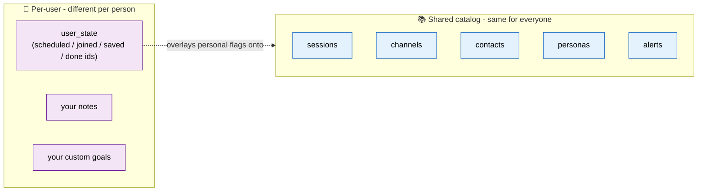
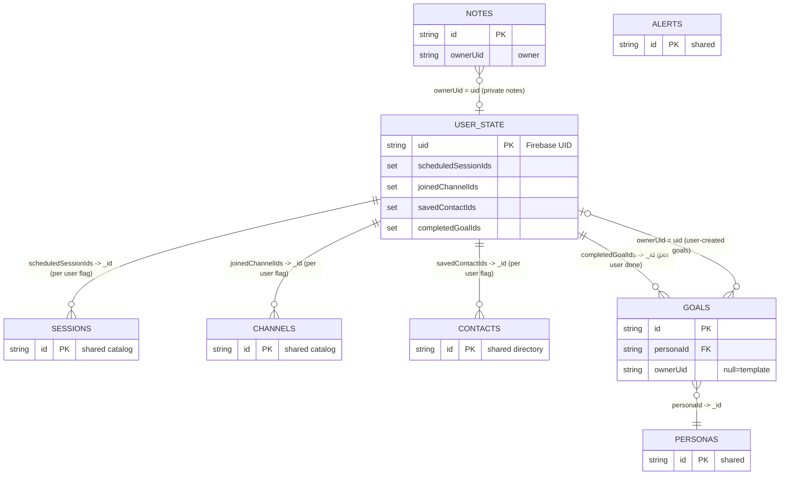
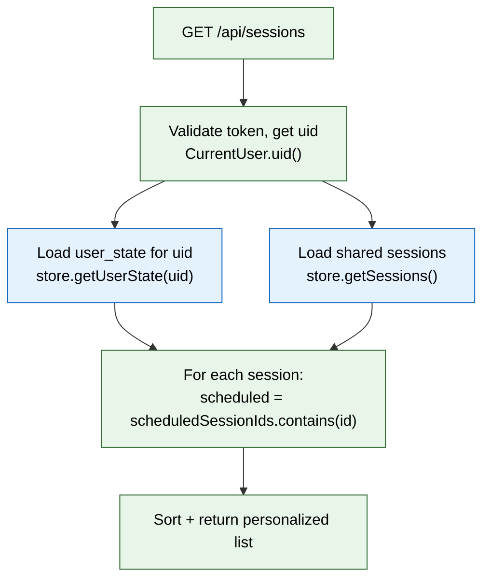

<div align="center">

# 🗃️ Service & Database Changes
### Per‑User Data Isolation — Phase 3


</div>

> [!NOTE]
> **Purpose of this document** — record **what we changed in the backend services and the
> database** to make every user see **only their own** data, including the **new
> collection** we created and how everything **relates**. Written so it’s easy to explain
> to anyone later.

---

## 📑 Table of contents

1. [The problem we solved](#1-the-problem-we-solved-plain-language)
2. [The new collection: `user_state`](#2-the-new-database-collection-user_state)
3. [Fields added to existing collections](#3-fields-added-to-existing-collections)
4. [Full collection map & relationships](#4-the-full-collection-map--relationships)
5. [How a request becomes personalized](#5-how-a-request-becomes-personalized-read-path)
6. [Service‑by‑service changes](#6-servicebyservice-changes)
7. [Seed data behavior](#7-seed-data-behavior-what-newexisting-users-see)
8. [Quick mental model](#8-quick-mental-model-for-explaining-to-anyone)
9. [Go live & verify](#9-to-make-it-live--verify)
10. [File map](#10-file-map-quick-reference)

---

## 1. The problem we solved (plain language)

Originally the app stored data **globally**: if one person marked a session as
“scheduled”, **everyone** saw it as scheduled. Notes, saved contacts and goal completion
were all shared. Now that people log in, each person must see **their own** schedule,
notes, saved contacts and goals — while still sharing the **common catalog** (the list of
all sessions, all channels, the contact directory, personas, alerts).

**The core trick:** we split data into two kinds:



Instead of copying the whole catalog per user, we keep the catalog shared and store only a
small **“who did what” record per user**. When you open a screen, the backend takes the
shared catalog and **stamps your personal flags on top** (scheduled / joined / saved /
done) before sending it to you.

---

## 2. The new database collection: `user_state`

We created **one new MongoDB collection** called **`user_state`**. It holds exactly **one
document per user**, keyed by the user’s Firebase **UID** (the `sub` from the token).

**Model:** `model/UserState.java`  → `@Document(collection = "user_state")`

| Field | Type | Meaning |
|-------|------|---------|
| `uid` (`@Id`) | String | The Firebase user id — the primary key (one doc per user) |
| `scheduledSessionIds` | `Set<String>` | Ids of sessions this user added to their schedule |
| `joinedChannelIds` | `Set<String>` | Ids of channels this user joined |
| `savedContactIds` | `Set<String>` | Ids of contacts this user saved |
| `completedGoalIds` | `Set<String>` | Ids of goals this user marked done |

Example document:
```json
{
  "_id": "firebase-uid-abc123",
  "scheduledSessionIds": ["s_101", "s_205"],
  "joinedChannelIds": ["c_12"],
  "savedContactIds": ["ct_7", "ct_19"],
  "completedGoalIds": ["g_ne_1"]
}
```

**Why sets of ids instead of copying objects?** Because the session/channel/contact objects
live **once** in the shared catalog. We only need to remember **which ones** each user
touched. This keeps the database small and means catalog updates are instantly visible to
everyone.

> [!TIP]
> **One document per person.** `user_state` grows by roughly one small document per user,
> not by copying the whole catalog — so it scales cleanly no matter how big the catalog gets.

**Repository:** `repository/UserStateRepository.java` — `extends MongoRepository<UserState, String>`.
Loaded via `getUserState(uid)`; if a user has no document yet, a fresh empty one is returned
(created on first save).

---

## 3. Fields added to existing collections

Two collections gained an **owner** field so we can tell user‑created records apart:

| Collection | New field | Meaning |
|-----------|-----------|---------|
| `goals` (`Goal.java`) | `ownerUid` (String, **nullable**) | `null` = shared **template** goal (seeded, read‑only, everyone sees). A UID = a goal that user created (only they see/delete it). |
| `notes` (`Note.java`) | `ownerUid` (String) | The user who owns the note. Notes are fully private per user. |

Nothing was removed from `sessions`, `channels`, `contacts`. Their per‑user flags
(`scheduled`, `joined`, `saved`) are **still on the model** but are now **computed at read
time** from `user_state` — they are **not** persisted globally anymore.

---

## 4. The full collection map & relationships



| Collection | Kind | Per‑user? | Notes |
|-----------|------|-----------|-------|
| `sessions` | Shared catalog | No (flags computed per user) | `scheduled` stamped from `user_state.scheduledSessionIds` |
| `channels` | Shared catalog | No (flags computed per user) | `joined` stamped from `user_state.joinedChannelIds` |
| `contacts` | Shared directory | No (flags computed per user) | `saved` stamped from `user_state.savedContactIds` |
| `personas` | Shared | No | Used to group goals |
| `alerts` | Shared | No | Same for everyone |
| `goals` | Mixed | Templates shared + user copies private | `ownerUid == null` → template; else owned; `done` per user via `completedGoalIds` |
| `notes` | Per user | Yes | Filtered by `ownerUid`; new users start empty |
| `saved_contacts` | (legacy) | Derived now | No longer served from this collection — the saved list is built from `savedContactIds` against `contacts` |
| `app_meta` | Shared singleton | No | Persona name, rooms, webex topics |
| **`user_state`** | **Per user (NEW)** | **Yes** | One doc per UID holding the four id sets |

---

## 5. How a request becomes “personalized” (read path)



Example: `GET /api/sessions`

1. Backend validates the token and gets the UID (`CurrentUser.uid()`).
2. Loads that user’s `UserState` (`store.getUserState(uid)`).
3. Loads the **shared** sessions catalog (`store.getSessions()`).
4. For each session: `session.setScheduled(scheduledSessionIds.contains(session.getId()))`.
5. Sorts and returns — the user sees the same catalog, with **their** scheduled flags.

Toggle example: `POST /api/sessions/{id}/schedule`
1. Get UID → load `UserState`.
2. If the id is in `scheduledSessionIds`, remove it (now unscheduled); else add it.
3. `saveUserState(state)` and return the session with the new flag.

> [!NOTE]
> The **same pattern** applies to channels (`joinedChannelIds`), contacts
> (`savedContactIds`), and goal completion (`completedGoalIds`).

---

## 6. Service‑by‑service changes

All services now inject `CurrentUser` to obtain the caller’s UID. **Controllers and the
API contract are unchanged** — the UID is read internally, never passed by the client.

| Service impl | What changed |
|--------------|--------------|
| `SessionServiceImpl` | `getSessions()` stamps `scheduled` from `scheduledSessionIds`; `toggleSchedule(id)` flips the id in `user_state` and saves |
| `ChannelServiceImpl` | `getChannels()` stamps `joined` from `joinedChannelIds`; `toggleJoin(id)` flips the id in `user_state` |
| `ContactServiceImpl` | `getContacts()` stamps `saved` from `savedContactIds`; `getSavedContacts()` **derives** the saved list from `savedContactIds` mapped against the shared `contacts`; `toggleSave(id)` flips the id |
| `NoteServiceImpl` | `getNotes()` returns only this user’s notes; `createNote` stamps `ownerUid`; `updateNote`/`deleteNote` only touch the user’s own notes |
| `PersonaServiceImpl` | `getGoals(personaId)` = shared templates + this user’s goals, with `done` stamped from `completedGoalIds`; `createGoal` stamps `ownerUid`; `toggleGoal` flips id in `completedGoalIds`; `deleteGoal` only deletes goals owned by the user |
| `InsightServiceImpl` | Uses this user’s note count and `savedContactIds` size |
| `SearchServiceImpl` | Searches this user’s notes; contacts remain the shared directory |

### The storage seam (`ConciergeStore`)
`ConciergeStore` is the interface both storage modes implement. It was updated so
user‑specific operations carry the `uid`, and it gained user‑state access:

- `getGoals(personaId, uid)`, `deleteGoal(personaId, goalId, uid)`
- `getNotes(uid)`, `findNote(id, uid)`, `deleteNote(id, uid)`
- `getUserState(uid)`, `saveUserState(state)`
- Removed now‑unused global writers: `saveContact`, `saveSession`, `saveChannel`,
  `getSavedContacts`

Two implementations:
- `MongoConciergeStore` — production (`app.use-dummy=false`). Injects `UserStateRepository`;
  goals = `findByPersonaIdAndOwnerUidIsNull` (templates) + `findByPersonaIdAndOwnerUid`
  (user’s own); notes via `findByOwnerUid`.
- `InMemoryConciergeStore` — dummy mode (`app.use-dummy=true`). Keeps an in‑memory
  `Map<uid, UserState>` and filters lists by `ownerUid`. (Dummy mode is dev‑only; not used
  in production.)

### Repository methods added
- `GoalRepository`: `findByPersonaIdAndOwnerUidIsNull`, `findByPersonaIdAndOwnerUid`
- `NoteRepository`: `findByOwnerUid`
- `UserStateRepository`: standard `MongoRepository` (findById by UID)

---

## 7. Seed data behavior (what new/existing users see)

- Seeded **persona goals** have `ownerUid = null` → they are **shared templates** everyone
  sees and can complete (completion tracked per user, not globally). Users cannot delete
  templates; they can create and delete **their own** goals.
- Seeded **notes** (if any) have `ownerUid = null` → **not shown** to anyone; every user
  starts with an **empty** notes list and builds their own.
- The old `saved_contacts` collection is no longer the source of the saved list — the saved
  list is **derived** per user from `savedContactIds`.

---

## 8. Quick mental model (for explaining to anyone)

> [!TIP]
> **The library analogy** 📚
> - **Catalog = shared library.** Everyone browses the same shelves (sessions, channels,
>   contacts).
> - **`user_state` = your personal checkout card.** It just lists the item ids *you* marked.
> - **Reading a screen = library + your card.** The backend overlays your card onto the
>   shared shelves so you see your own “scheduled / joined / saved / done” marks.
> - **Notes and your custom goals = your private drawer.** Tagged with your `ownerUid`;
>   nobody else can see them.
> - **Your identity comes from the login token**, so the backend always knows whose card
>   and drawer to use — no way to peek at someone else’s.

---

## 9. To make it live & verify

```powershell
# Compile the backend
cd 'C:\Code\feb-ciscolive-concierge\feb-ciscolive-concierge'
.\mvnw.cmd clean compile      # expect: BUILD SUCCESS
```
Then **redeploy the backend to Cloud Run**. No Flutter changes are required (API contract
unchanged).

> [!IMPORTANT]
> **Verify with two accounts:** log in as two different users → each has independent
> scheduled sessions, joined channels, saved contacts, notes and completed goals, while the
> underlying session/channel/contact catalog looks identical to both. A request with **no
> token** returns **401**.

---

## 10. File map (quick reference)

**New**
- `model/UserState.java` — the per‑user state document (`user_state`)
- `repository/UserStateRepository.java`
- `config/CurrentUser.java` — reads UID from the token

**Changed models / repos**
- `model/Goal.java` (+`ownerUid`), `model/Note.java` (+`ownerUid`)
- `repository/GoalRepository.java`, `repository/NoteRepository.java`

**Changed storage & services**
- `service/ConciergeStore.java` (interface) + `service/impl/MongoConciergeStore.java` +
  `service/impl/InMemoryConciergeStore.java`
- `service/impl/{Session,Channel,Contact,Note,Persona,Insight,Search}ServiceImpl.java`
